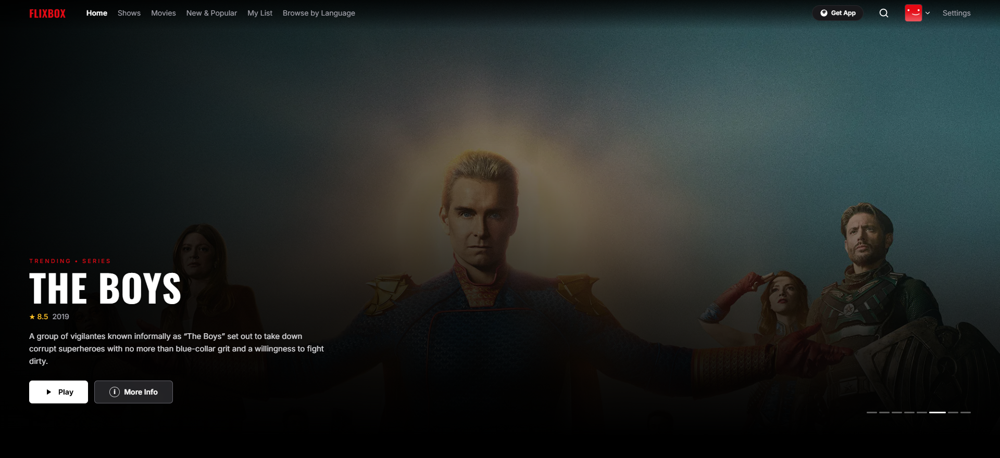
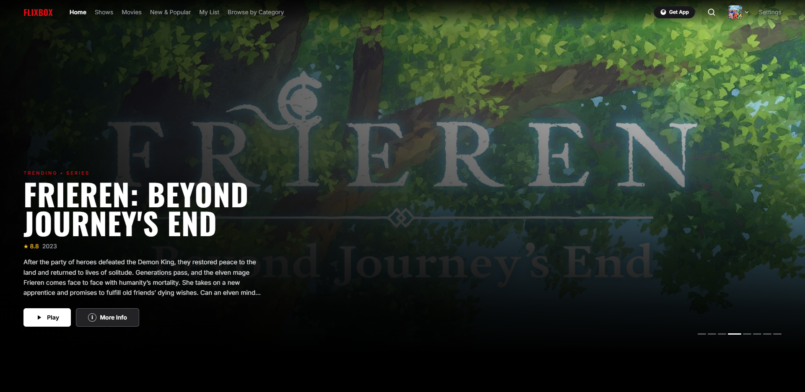
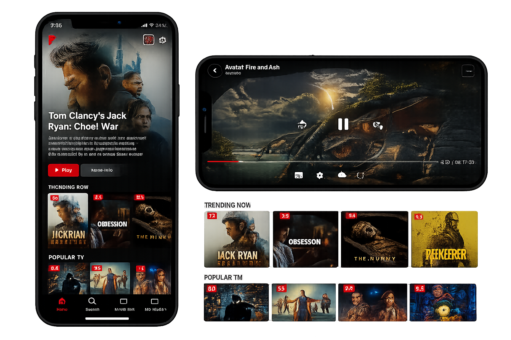
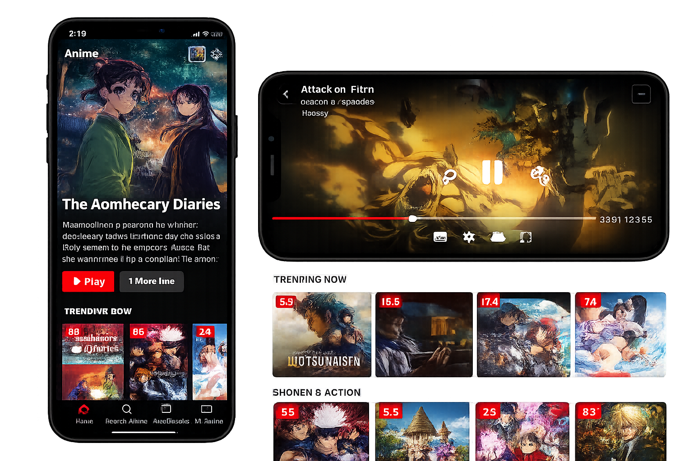

# FlixBox

FlixBox is a full-stack streaming platform that lets a small group of people browse movies, TV shows, and anime together. It comes as two products — a **website** you can open in any browser, and an **Android app** you can install directly on your phone. Both are built and maintained by Likith Yadav as a personal project.

---

## Screenshots

### Website

| Movies & TV | Anime |
|:-----------:|:-----:|
|  |  |

### Android App

| Movies & TV | Anime |
|:-----------:|:-----:|
|  |  |

---

## Download Android App

👉 **[Download FlixBox v2.0.0 APK](https://github.com/Likith-Yadav/FlixBox/releases/download/v2.0.0/FlixBox-v2.apk)**

Enable "Install unknown apps" on your Android device, then open the downloaded APK to install.

---

## What It Does

FlixBox pulls real metadata — titles, posters, descriptions, cast, ratings — from The Movie Database (TMDB) and presents it in a clean, Netflix-inspired interface. Users can browse by category, search across the entire catalogue, save titles to a personal list, and track what they have been watching. The platform supports multiple profiles on a single account, so different people sharing a device each get their own history and list.

The watch party feature lets a small group of friends start a shared session from any browser. One person hosts and controls the playback — play, pause, and seek — while everyone else follows in real time. The session also includes a live chat and optional video call between participants, powered by WebRTC directly in the browser without any additional software.

---

## The Website

The website is a React application built with TypeScript and Vite, styled with Tailwind CSS. It communicates with a Node.js backend that handles user accounts, watch history, settings, and watch party sessions. The backend uses PostgreSQL as its database and Socket.io for the real-time features.

The frontend is hosted on Vercel and the backend runs on Render. API calls and socket connections from the browser are routed to the Render backend using an environment variable so the two can be deployed independently. The site is live at flixbox.in.

Signing up requires an invite code, so the platform stays limited to a small circle of people. There is no open registration. Each registered user gets their own profile, watch history, and settings that are stored in the database and available on any device they sign in from.

---

## The Android App

The Android app is built with Expo and React Native. It offers the same browsing and streaming experience as the website in a native mobile package. The app includes a built-in video player with full-screen support and gesture controls, subtitle support through the Wyzie API, and a short intro video that downloads once and plays offline on every launch after that.

The app is distributed as a direct APK download rather than through the Play Store. Users enable installation from unknown sources on their Android device and install it like any other file. There is no iOS version.

---

## Technology

The website frontend is React 19 with TypeScript, built by Vite 7, styled with Tailwind CSS, and uses React Router for navigation. The backend is Express running on Node.js with a PostgreSQL database. Real-time features use Socket.io on the server and the socket.io-client library on the frontend. WebRTC handles the peer-to-peer video calls in the watch party without going through the server.

The Android app is Expo SDK 56 with React Native, written in TypeScript, and uses Expo Router for navigation between screens. The video player uses the expo-video package. Persistent storage uses AsyncStorage. The app is built and distributed through EAS Build without requiring Android Studio.

Both projects use the TMDB API for all movie and show metadata. The read-only token is shared across all users and embedded in the frontend at build time.

---

## Project Structure

The repository contains two top-level folders. The Website folder holds the React frontend and the Node.js backend as a monorepo — running both together in development takes a single command from the Website directory. The App folder is a standalone Expo project with its own dependencies and build configuration.

---

## Running Locally

To run the website locally you need Node.js, a PostgreSQL database, and a TMDB read token. Copy the example environment files in both the root and the backend directory, fill in the database URL, JWT secret, and TMDB token, then start everything with the dev:all script from the Website directory. The frontend runs on port 5173 and the backend on port 3001, with Vite proxying API and socket requests in development so no cross-origin configuration is needed.

To run the Android app locally you need Node.js and the Expo Go app on your phone, or an Android emulator. Install dependencies in the App directory and run the start script. Scan the QR code with Expo Go to launch the app on your device.

---

## Deployment

The website frontend deploys to Vercel by connecting the GitHub repository and pointing Vercel at the Website directory. A vercel.json file in the root handles client-side routing so page refreshes work correctly on any route. The backend deploys to Render as a web service with the root directory set to Website/backend. Environment variables for the database, JWT secret, allowed origins, and TMDB token are set directly in each platform's dashboard.

The Android app is built using EAS Build from Expo's cloud infrastructure. No local Android SDK or Android Studio is required. The resulting APK is attached to a GitHub release and shared directly with users as a download link.

👉 **[Download FlixBox v2.0.0 APK](https://github.com/Likith-Yadav/FlixBox/releases/download/v2.0.0/FlixBox-v2.apk)**

---

## Legal Note

FlixBox is a personal project for private use among a small group of people. It does not host or serve any video files. Metadata displayed in the interface comes from the TMDB API under their terms of service. The platform is not affiliated with any studio, streaming service, or content provider.

---

## Author

Built by Likith Yadav — [github.com/Likith-Yadav](https://github.com/Likith-Yadav)
